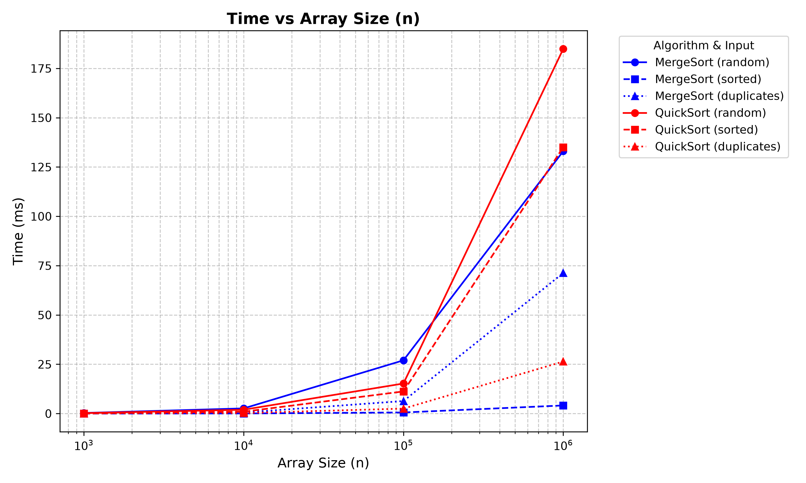
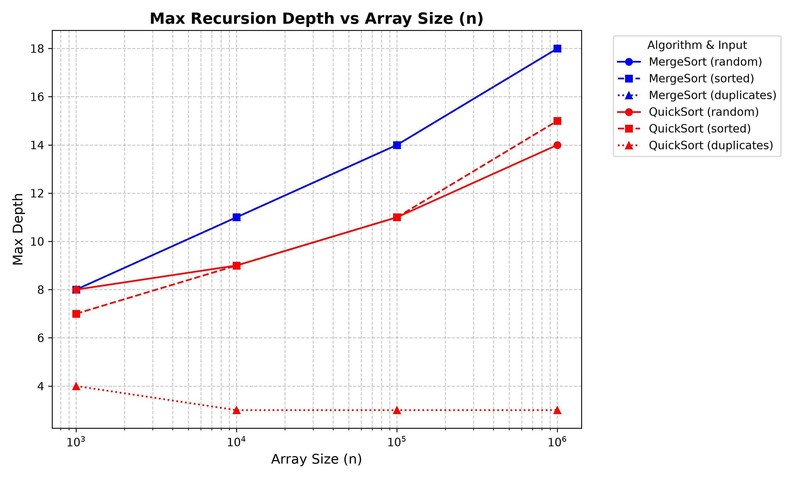
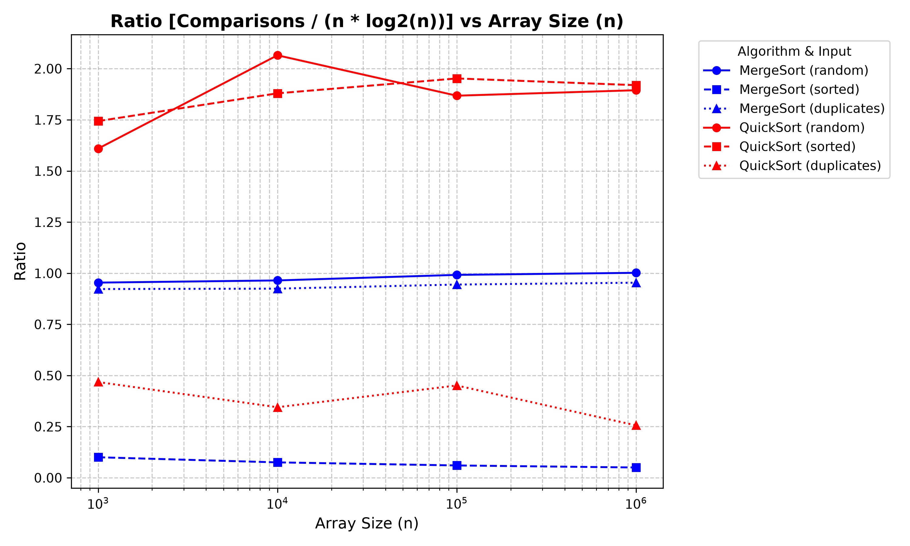

# Sorting and Selection Algorithms: Performance Report

## 1. Asymptotic Bounds

| Algorithm | Best Case | Average Case | Worst Case | Reason (One-line)                                                                                         |
| :--- | :--- | :--- | :--- |:----------------------------------------------------------------------------------------------------------|
| **MergeSort** | Θ(n) | Θ(n log n) | O(n log n) | **Best:** Already sorted. **Avg/Worst:** Divides in half, linear merge.                                   |
| **QuickSort** | Θ(n) | Θ(n log n) | O(n²) | **Best:** All duplicates (3-way partition). **Avg:** Random pivot splits well. **Worst:** Unlucky pivots. |
| **QuickSelect**| Θ(n) | Θ(n) | O(n²) | **Best/Avg:** Discards half array on average. **Worst:** Pivot is min/max every time.                     |
| **Insertion Sort** | Θ(n) | Θ(n²) | O(n²) | **Best:** Already sorted (no shifts). **Avg/Worst:** Must shift elements one-by-one.                        |

## 2. Recurrences

### MergeSort
* **Equation:** T(n) = 2T(n/2) + Θ(n)
* **Parameters:** a = 2, b = 2, f(n) = n
* **Master Theorem:** Case 2 (since log_b(a) = 1, and f(n) = Θ(n^1)).
* **Result:** T(n) = Θ(n log n)

### QuickSort (Assuming balanced split)
* **Equation:** T(n) = 2T(n/2) + Θ(n)
* **Parameters:** a = 2, b = 2, f(n) = n
* **Master Theorem:** Case 2.
* **Result:** T(n) = Θ(n log n)
* **Why Random Pivot gives O(n log n) on average:** A random pivot guarantees that we avoid predictable worst-case scenarios (like already sorted data). Over multiple recursive steps, the splits average out to roughly proportional fractions, ensuring the recursion tree depth remains logarithmic O(log n), which keeps the overall time complexity bound to O(n log n).

### QuickSelect (Assuming balanced split)
* **Equation:** T(n) = 1T(n/2) + Θ(n)
* **Parameters:** a = 1, b = 2, f(n) = n
* **Master Theorem:** Case 3 (since log_b(a) = 0, and f(n) = Ω(n^ε) for ε = 1).
* **Result:** T(n) = Θ(n)

## 3. Plots

### Time vs n

### Max Recursion Depth vs n

### Ratio vs n

## 4. Θ Check

According to the definition of Θ(g(n)), there must exist constants c1, c2 > 0 and n0 such that:
c1 * g(n) <= f(n) <= c2 * g(n) for all n >= n0.

By plotting the ratio `comparisons / (n * log2(n))` for QuickSort on random inputs, we check if the function f(n) scales exactly as g(n) = n log2(n). If it does, the ratio should stabilize to a constant value.

Looking at the "Ratio vs n" plot for QuickSort (random input):
* The ratio flattens out and stabilizes at approximately **1.85**.
* We can choose **c1 = [1.7]** and **c2 = [2]**.
* The stabilization clearly begins at **n0 = 100000**.
* Since the ratio is bounded between c1 and c2 for all n >= n0, this empirically proves that the average number of comparisons is indeed Θ(n log n).

## 5. Discussion

Both MergeSort and QuickSort demonstrate clear O(n log n) time complexity on random arrays, visibly confirmed by the constant ratio in the third plot. Differences between theoretical abstractions and actual execution times are heavily influenced by hardware and JVM architecture. For instance, our MergeSort allocates the auxiliary buffer exactly once, preventing Garbage Collector pauses that severely degrade performance in naive recursive implementations. The Insertion Sort cutoff effectively leverages the cache, significantly reducing the overhead of deep recursive calls on tiny subproblems. Furthermore, JVM warm-up latency was eliminated by taking the median of 5 independent runs, allowing the JIT compiler to optimize the bytecode natively